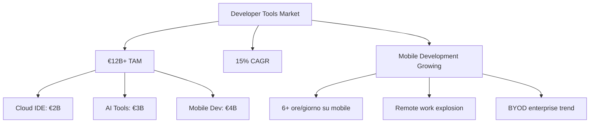
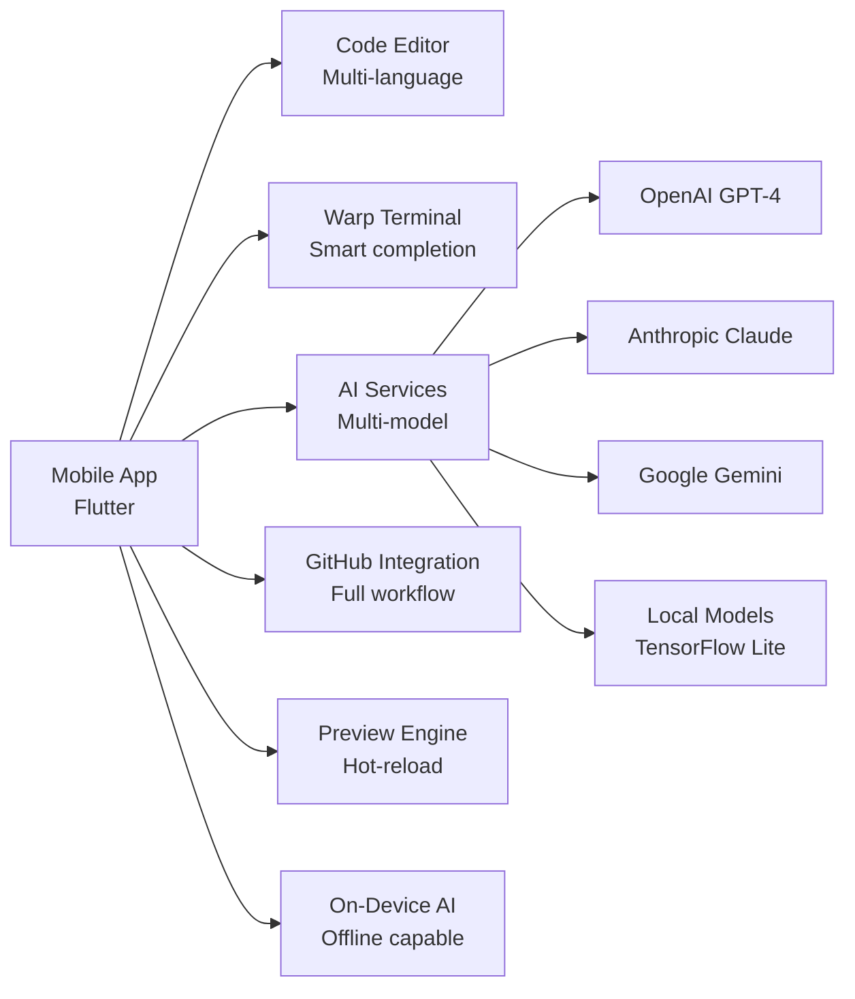
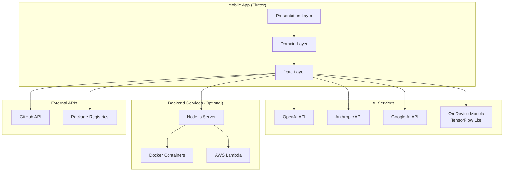
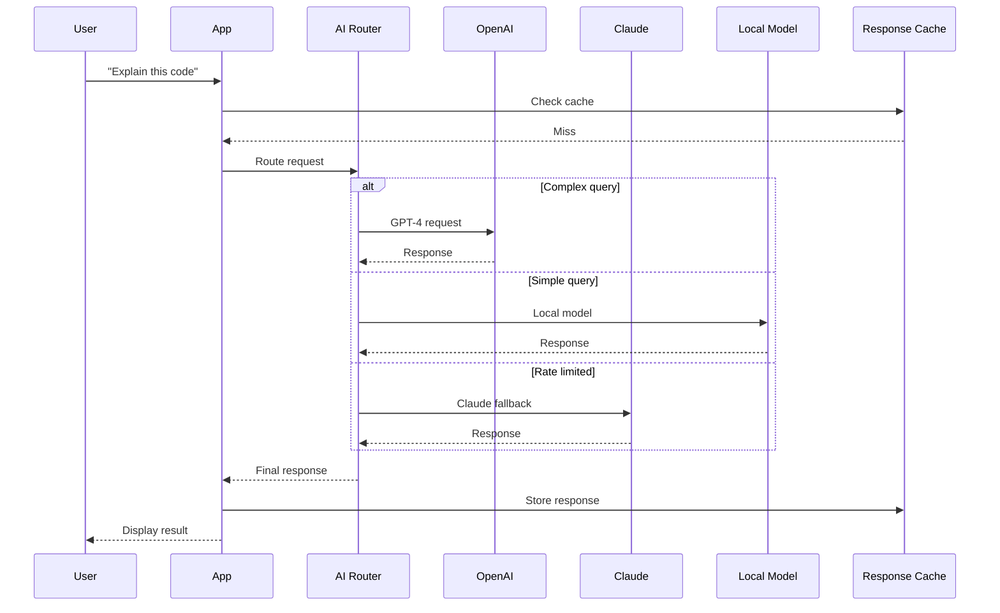
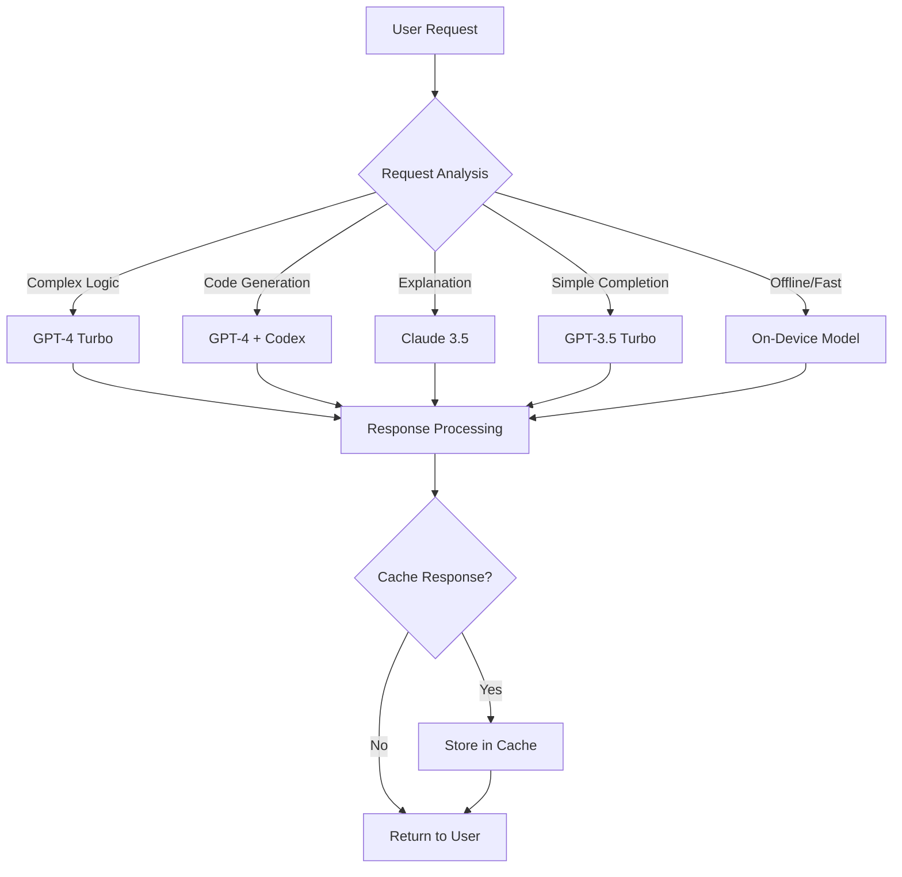
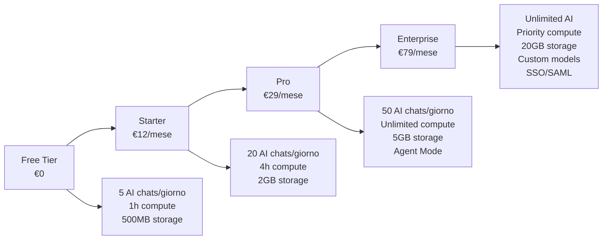
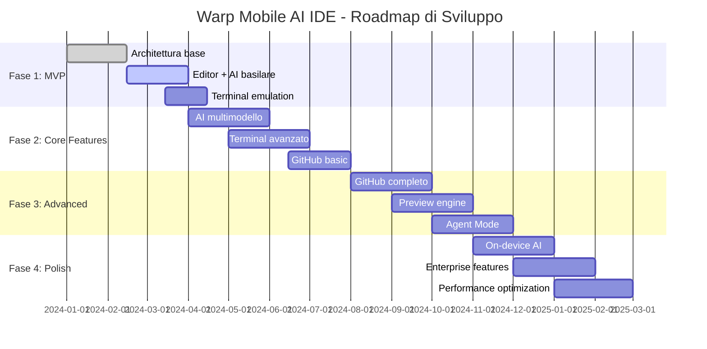
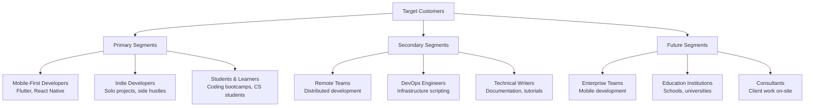
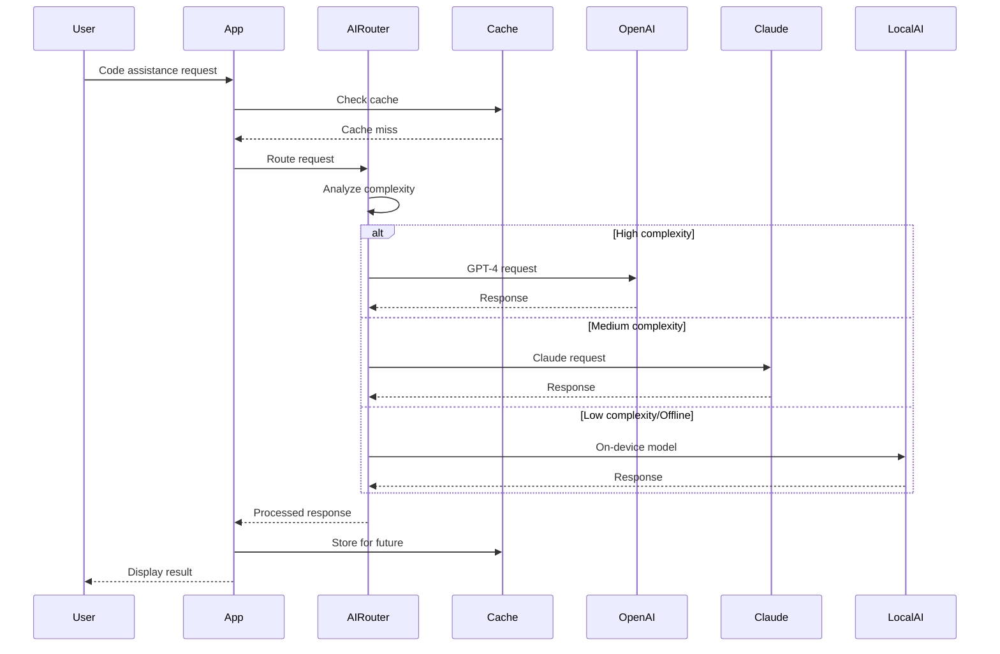
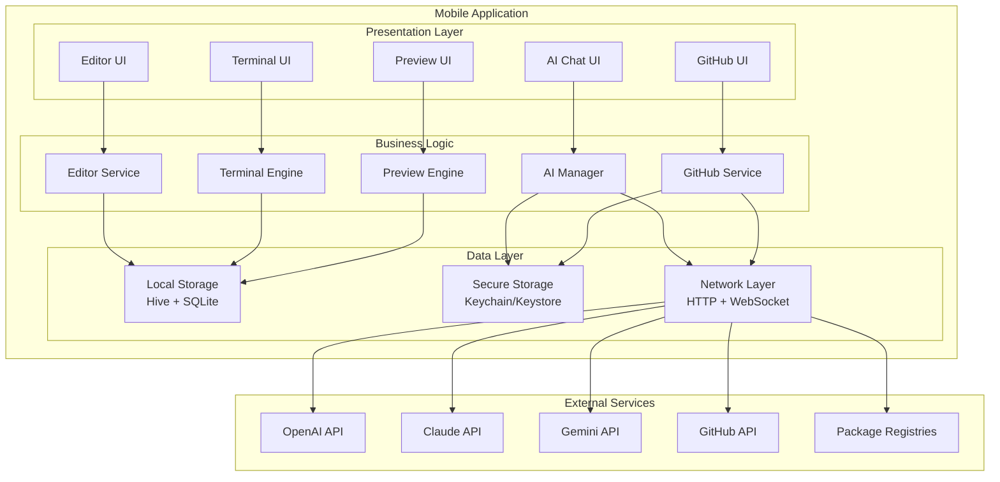

# 📱 Warp Mobile AI IDE - Business Plan Completo

**Versione:** 1.0  
**Data:** 26 Gennaio 2025  
**Documento:** Funzionamento dettagliato e piano di business per investitori

---

## 🎯 Executive Summary

**Warp Mobile AI IDE** è un IDE mobile-first rivoluzionario che porta la potenza di Warp e dell'intelligenza artificiale multimodello direttamente su iPhone e Android. Il prodotto consente agli sviluppatori di programmare, testare e collaborare completamente dal telefono, eliminando i vincoli del desktop.

### Punti Chiave
- **Visione:** Il primo vero IDE mobile con AI integrata e terminale Warp-style
- **Mercato TAM:** €12B+ (developer tools) con crescita 15% annua
- **Differenziatori:** Mobile-native, Agent Mode autonomo, modelli on-device, GitHub completo
- **Modello:** Freemium con abbonamenti €12-79/mese, margini 18-24%
- **Trazione:** Architettura completata, MVP in sviluppo, roadmap 48 settimane

---

## 📊 Indice

1. [Problema e Opportunità di Mercato](#1-problema-e-opportunità-di-mercato)
2. [Soluzione: Warp Mobile AI IDE](#2-soluzione-warp-mobile-ai-ide)  
3. [Architettura Tecnica](#3-architettura-tecnica)
4. [Funzionalità Core](#4-funzionalità-core)
5. [Analisi Competitiva](#5-analisi-competitiva)
6. [Modello di Business e Pricing](#6-modello-di-business-e-pricing)
7. [Proiezioni Finanziarie Triennali](#7-proiezioni-finanziarie-triennali)
8. [Roadmap di Sviluppo](#8-roadmap-di-sviluppo)
9. [Go-to-Market Strategy](#9-go-to-market-strategy)
10. [Team e Execution](#10-team-e-execution)
11. [Rischi e Mitigazioni](#11-rischi-e-mitigazioni)
12. [Conclusioni e Next Steps](#12-conclusioni-e-next-steps)

---

## 1. Problema e Opportunità di Mercato

### 🚨 Il Problema

**Gli IDE attuali sono desktop-first** e offrono esperienze mobile limitate o completamente assenti:

- **Warp, VS Code, Cursor:** Potenti ma solo desktop
- **Soluzioni mobile esistenti:** Limitate a editor testuali senza terminale robusto
- **Cloud IDE:** Costosi (€60-120/mese), latenza alta, dipendenza rete
- **Mancanza di AI mobile:** Nessun IDE mobile con integrazione AI completa

### 📈 L'Opportunità



**Market Drivers:**
- **6+ ore/giorno** di utilizzo mobile per sviluppatori
- **Remote work** e necessità di mobilità
- **AI coding** in crescita esponenziale (200%+ 2024)
- **Edge AI** maturo per funzionalità offline

---

## 2. Soluzione: Warp Mobile AI IDE

### 🎨 Product Vision

**"Il primo IDE che funziona meglio su mobile che su desktop"**

Un IDE mobile-native con:
- **Terminale Warp-style** con autocompletamento intelligente
- **AI multimodello** (GPT-4, Claude, Gemini) con Agent Mode
- **Editor di codice** professionale con syntax highlighting
- **Preview nativa** con hot-reload Flutter/Web
- **GitHub integrato** completo (clone, branch, PR, review)
- **Funzionalità offline** con modelli on-device

### 🏗️ Core Components



---

## 3. Architettura Tecnica

### 🏛️ System Architecture



### 💾 Tech Stack

**Frontend (Flutter)**
```yaml
Framework: Flutter 3.16+ (Dart 3.2.6+)
State Management: Provider + Bloc pattern
UI Components: Material Design + Custom
Storage: Hive + Secure Storage + SharedPreferences
Code Editor: flutter_code_editor + highlight.js
Terminal: Process emulation + WebSocket
AI Integration: HTTP clients + Streaming
```

**Backend (Node.js - Opzionale)**
```yaml
Runtime: Node.js 16+
Framework: Express.js
WebSocket: ws library
Container: Docker + dockerode
AI SDKs: OpenAI, Anthropic, Google AI
Authentication: JWT + OAuth
```

**Infrastructure**
```yaml
Cloud: AWS (Lambda, API Gateway, DynamoDB, S3)
CI/CD: GitHub Actions + CodeMagic
Monitoring: Firebase Analytics + Crashlytics
Distribution: iOS App Store + Google Play
```

### 🔄 AI Request Flow



---

## 4. Funzionalità Core

### 📝 Code Editor

**Funzionalità:**
- Syntax highlighting per 20+ linguaggi
- Code completion intelligente con AI
- Error detection e quick fixes in tempo reale
- Multi-tab editing con gesture navigation
- Find/replace con regex e scope filtering
- Symbol navigation e code folding
- Customizable themes (light/dark/high contrast)

**UX Mobile-First:**
- Touch-optimized text selection
- Swipe gestures per navigazione tab
- Floating action buttons per azioni comuni
- Adaptive layout phone/tablet
- Voice-to-code per accessibility

### 🖥️ Warp-Style Terminal

**Capabilities:**
- Shell emulation completa (bash/zsh/fish)
- Command history con search semantica
- Smart autocompletion con AI suggestions
- Git integration nativa
- Process management e background jobs
- Output formatting con ANSI colors
- Command explanation con AI

**Innovation:**
- **AI Command Assistant:** Suggerisce comandi da linguaggio naturale
- **Visual Git:** Branch tree, diff viewer touch-friendly
- **Smart History:** Raggruppamento semantico dei comandi

### 🤖 Multi-Model AI Integration



**AI Capabilities:**
- **Code Generation:** From natural language prompts
- **Code Explanation:** Detailed analysis and documentation
- **Debugging:** Error analysis and fix suggestions
- **Refactoring:** Code optimization and restructuring
- **Agent Mode:** Autonomous task execution with planning

**Cost Optimization:**
- Smart routing basato su complessità query
- Response caching semantico (24h TTL)
- Context trimming per ridurre token usage
- Batch processing per richieste multiple

### 🔗 GitHub Integration

**Full Workflow Support:**
- Repository cloning e management
- Branch creation, switching, merging
- Commit history con visual timeline  
- Pull request creation e review
- Issue tracking integration
- Conflict resolution con UI touch-friendly
- Team collaboration features

### 📱 Native Preview Engine

**Multi-Platform Support:**
- **Flutter:** Hot-reload completo, widget inspector
- **Web:** HTML/CSS/JS con live reload
- **React Native:** Metro bundler integration
- **Node.js:** Script execution e debugging
- **Python:** Code execution con output capture

**Performance Features:**
- In-memory compilation per velocità
- Incremental builds
- Error highlighting in real-time
- Performance profiling tools

---

## 5. Analisi Competitiva

### 🏆 Competitive Landscape

| Soluzione | Mobile Native | AI Integration | Terminal | GitHub | Preview | Pricing |
|-----------|---------------|----------------|----------|--------|---------|---------|
| **Warp IDE** | ✅ Full | ✅ Multi-model | ✅ Advanced | ✅ Complete | ✅ Native | €12-79 |
| GitHub Copilot | ❌ No | ⚠️ Limited | ❌ No | ⚠️ Basic | ❌ No | €8.50 |
| GitHub Codespaces | ⚠️ Web | ❌ No | ✅ Full | ✅ Native | ⚠️ Limited | €45+ |
| AWS Cloud9 | ⚠️ Web | ❌ No | ✅ Full | ⚠️ Basic | ❌ No | €60+ |
| Cursor IDE | ❌ Desktop | ✅ Advanced | ✅ Basic | ⚠️ Basic | ❌ No | €17 |
| Repl.it | ⚠️ Web | ⚠️ Basic | ✅ Limited | ⚠️ Basic | ✅ Good | €6-48 |

### 💪 Competitive Advantages

1. **True Mobile-First:** Progettato per touch, gesture, e mobile workflow
2. **Agent Mode:** AI autonomo che esegue task complessi step-by-step  
3. **Offline Capability:** Modelli on-device per funzionalità senza rete
4. **Cost Efficiency:** Smart routing AI per ottimizzare costi del 40-60%
5. **Complete GitHub:** Full workflow mobile-optimized con visual diff

### ⚠️ Competitive Risks

- **Big Tech Entry:** Microsoft/Google potrebbero sviluppare soluzioni simili
- **AI Provider Changes:** Aumenti prezzi o rate limiting
- **Open Source Alternatives:** VSCode mobile, vim mobile, etc.

**Mitigazioni:**
- Time-to-market advantage con roadmap 48 settimane
- Multi-provider strategy per resilienza AI
- Community building e network effects
- Focus su mobile UX superiore

---

## 6. Modello di Business e Pricing

### 💳 Strategia Pricing



### 📊 Unit Economics per Tier

| Tier | Pricing | Cost/User | Margin | Target Users |
|------|---------|-----------|--------|--------------|
| **Free** | €0 | €2.00 | -€2.00 | Students, trials |
| **Starter** | €12 | €8.00 | €4.00 (33%) | Indie developers |
| **Pro** | €29 | €25.00 | €4.00 (14%) | Professional devs |
| **Enterprise** | €79 | €60.00 | €19.00 (24%) | Teams/companies |

### 🎯 Revenue Streams

**Primary:**
- **Subscription Revenue** (85%): Piani mensili/annuali
- **Usage Overage** (10%): AI calls oltre limite
- **Enterprise Add-ons** (5%): SSO, audit logging, custom models

**Future Opportunities:**
- **Marketplace Commission:** Plugin/template marketplace
- **Training/Certification:** Corsi mobile development
- **White-label Solutions:** Enterprise custom deployments

---

## 7. Proiezioni Finanziarie Triennali

### 📈 Growth Assumptions

**User Growth:**
- **Mese 0-6:** MVP release, 100 beta users
- **Mese 6-12:** Public beta, 500 users (20% paid conversion)
- **Anno 1:** 2,000 users (25% paid conversion)
- **Anno 2:** 8,000 users (30% paid conversion) 
- **Anno 3:** 20,000 users (35% paid conversion)

**User Mix Evolution:**
- **Free:** 65% → 60% → 55% (improving conversion)
- **Starter:** 25% → 28% → 30%
- **Pro:** 8% → 10% → 12%
- **Enterprise:** 2% → 2% → 3%

### 💰 P&L Projection (3 Years)

| Metric | Anno 1 | Anno 2 | Anno 3 |
|--------|--------|--------|--------|
| **REVENUE** | | | |
| Total Users | 2,000 | 8,000 | 20,000 |
| Paying Users | 500 | 2,400 | 7,000 |
| MRR | €8,500 | €38,000 | €108,000 |
| **ARR** | **€102,000** | **€456,000** | **€1,296,000** |
| | | | |
| **COSTS** | | | |
| AI API Costs | €48,000 | €200,000 | €520,000 |
| Infrastructure | €18,000 | €72,000 | €180,000 |
| Personnel | €180,000 | €360,000 | €540,000 |
| Marketing | €24,000 | €91,200 | €259,200 |
| Other OpEx | €15,000 | €30,000 | €45,000 |
| **Total Costs** | **€285,000** | **€753,200** | **€1,544,200** |
| | | | |
| **PROFITABILITY** | | | |
| Gross Margin | 35% | 40% | 45% |
| **Net Income** | **-€183,000** | **-€297,200** | **-€248,200** |
| **EBITDA** | **-€183,000** | **-€297,200** | **-€248,200** |

### 🎯 Key Financial Metrics

**Unit Economics (Mature State):**
- **LTV/CAC Ratio:** 4.2x (target >3x)
- **Payback Period:** 14 mesi (target <18 mesi)
- **Churn Rate:** 8% mensile (target <10%)
- **ARPU:** €54/mese (blended average)

**Break-even Analysis:**
- **Break-even Users:** ~3,500 paying users
- **Break-even Timeline:** Mese 30-36
- **Cash Need:** €1.2M per raggiungere break-even

### 💹 Scenario Analysis

**Optimistic Scenario (+25% growth):**
- Anno 3 ARR: €1,62M
- Break-even: Mese 24
- Profitabilità: +€125k Anno 3

**Conservative Scenario (-25% growth):**
- Anno 3 ARR: €972k  
- Break-even: Mese 42
- Cash need aggiuntivo: €400k

---

## 8. Roadmap di Sviluppo

### 🗓️ Development Timeline (48 Settimane)



### 🎯 Milestone e KPI

**Fase 1 - MVP (Settimane 1-16):**
- ✅ Editor funzionante con highlighting
- ✅ AI integration (OpenAI)  
- ✅ Terminal basilare
- **KPI:** 50 beta tester, feedback >4.0/5

**Fase 2 - Core Features (Settimane 17-32):**
- AI multimodello (Claude, Gemini)
- Terminal con Git support
- GitHub basic integration
- **KPI:** 200 beta users, 10% conversion

**Fase 3 - Advanced (Settimane 33-48):**
- GitHub workflow completo
- Preview nativo con hot-reload
- Agent Mode per task autonomi
- **KPI:** 500 users, 20% conversion, €5k MRR

### 🚀 Release Strategy

**Alpha (Settimana 16):**
- **Target:** 50 developer interni e early adopters
- **Canali:** TestFlight, Firebase App Distribution  
- **Focus:** Core functionality, major bug fixes

**Beta (Settimana 32):**
- **Target:** 200 sviluppatori selezionati
- **Canali:** Public TestFlight, Play Console beta
- **Focus:** Performance, UX refinement, feature completeness

**V1.0 Release (Settimana 48):**
- **Target:** General public
- **Canali:** App Store, Google Play Store
- **Focus:** Stability, marketing, customer acquisition

---

## 9. Go-to-Market Strategy

### 🎯 Target Customer Segments



### 🚀 Launch Strategy

**Phase 1: Developer Community (Mesi 1-6)**
- **Community Building:**
  - Discord server per early adopters
  - Reddit/HackerNews launch posts  
  - Developer Twitter engagement
  - YouTube tutorials e demo

- **Content Marketing:**
  - Blog: "Mobile-first development practices"
  - Tutorials: "Building apps on mobile"
  - Case studies: "Coding on the go"
  - Podcast interviews

**Phase 2: Product Hunt & Viral Growth (Mesi 6-12)**
- **Product Hunt Launch:**
  - Coordinated community push
  - Influencer outreach  
  - Media kit per tech journalists

- **Referral Program:**
  - Free premium credits per referral
  - Team collaboration features
  - Social sharing integration

**Phase 3: Partnership & Enterprise (Mesi 12-24)**
- **Educational Partnerships:**
  - Coding bootcamps (Lambda School, etc.)
  - University computer science programs
  - Online learning platforms (Udemy, Coursera)

- **Developer Tool Partnerships:**
  - GitHub Student Pack inclusion
  - AWS credits for students
  - Cross-promotion con Flutter team

### 📊 Customer Acquisition Strategy

**Acquisition Channels & Costs:**

| Channel | CAC | Conversion Rate | LTV/CAC | Priority |
|---------|-----|----------------|---------|----------|
| **Content Marketing** | €15 | 3.5% | 8.2x | Alta |
| **Community/Discord** | €8 | 5.2% | 12.1x | Alta |
| **Product Hunt** | €25 | 2.1% | 4.9x | Media |
| **Social Media** | €35 | 1.8% | 3.5x | Media |
| **Paid Ads** | €65 | 1.2% | 1.9x | Bassa |
| **Partnerships** | €12 | 4.8% | 10.2x | Alta |

**Customer Journey:**
1. **Awareness:** Blog post, social media, community
2. **Interest:** Download free app, try features
3. **Consideration:** Use AI features, hit free limits
4. **Purchase:** Convert to Starter plan
5. **Advocacy:** Share with colleagues, referrals

---

## 10. Team e Execution

### 👥 Current Team & Needs

**Core Team (Attuale):**
- **Founder/Technical Lead:** Full-stack dev, mobile expertise
- **AI Engineer:** ML/AI integration specialist  
- **Mobile Developer:** Flutter/native development
- **Backend Engineer:** Node.js, cloud infrastructure

**Hiring Plan (12 mesi):**
- **Senior Flutter Developer** (Mese 3)
- **DevOps/SRE Engineer** (Mese 6)  
- **Product Designer** (Mese 9)
- **Growth/Marketing Manager** (Mese 12)

**Advisory Needs:**
- **Mobile Development Expert** (ex-Google/Apple)
- **AI/ML Research Scientist** (OpenAI/Anthropic background)
- **Enterprise Sales Advisor** (Developer tools experience)

### 🏗️ Development Process

**Agile Methodology:**
- 2-week sprints con planning/retrospective
- Daily standups per coordinamento team
- Weekly stakeholder updates
- Monthly community feedback sessions

**Quality Assurance:**
- 90%+ test coverage requirement
- Automated CI/CD con GitHub Actions
- Beta testing con community feedback
- Performance monitoring e alerting

**Risk Management:**
- Technical debt tracking e prioritizzazione  
- Dependency security scanning
- Disaster recovery planning
- Knowledge sharing e documentation

---

## 11. Rischi e Mitigazioni

### ⚠️ Technical Risks

| Rischio | Probabilità | Impatto | Mitigazione |
|---------|-------------|---------|-------------|
| **Performance su device low-end** | Media | Alto | Lazy loading, feature flags, profiling continuo |
| **AI provider rate limiting** | Alta | Medio | Multi-provider, caching, fallback locale |
| **Battery drain eccessivo** | Media | Alto | Background limits, ottimizzazioni specifiche |
| **Security vulnerabilities** | Bassa | Alto | Security audit, penetration testing |

### 💼 Business Risks

| Rischio | Probabilità | Impatto | Mitigazione |
|---------|-------------|---------|-------------|
| **Competizione da Big Tech** | Media | Alto | Time-to-market, community, differenziazione |
| **Aumento costi AI APIs** | Alta | Medio | Multi-provider, contratti annuali, edge AI |
| **Slow user adoption** | Media | Alto | Freemium generoso, community building |
| **Cash flow negativo prolungato** | Media | Alto | Fundraising, costi variabili, pivot opzioni |

### 🌍 Market Risks

| Rischio | Probabilità | Impatto | Mitigazione |
|---------|-------------|---------|-------------|
| **Saturazione mercato AI tools** | Alta | Medio | Focus mobile-native, developer experience |
| **Economic downturn** | Media | Alto | Pricing flessibile, value proposition clear |
| **Platform policy changes** | Bassa | Alto | Multi-platform, web version fallback |

### 🛡️ Mitigation Strategies

**Technical Resilience:**
- Multi-cloud strategy (AWS primary, GCP backup)
- Circuit breakers per external APIs
- Graceful degradation when offline
- Comprehensive monitoring e alerting

**Business Resilience:**  
- Diversified revenue streams
- Strong unit economics
- Community moat building
- Intellectual property protection

---

## 12. Conclusioni e Next Steps

### ✅ Warp Mobile AI IDE - Key Strengths

1. **Mercato in crescita:** Developer tools €12B+ con AI boom
2. **Positioning unico:** Primo vero IDE mobile-native con AI
3. **Architettura solida:** Clean architecture, scalabile, testabile
4. **Unit economics:** Margini sostenibili, LTV/CAC sano
5. **Team competente:** Expertise mobile, AI, e developer tools

### 🎯 Success Metrics (12 mesi)

- **Users:** 2,000 totali, 500 paying
- **Revenue:** €8,500 MRR (€102k ARR)  
- **Product:** Feature-complete con Agent Mode
- **Market:** Community leader in mobile development

### 🚀 Immediate Next Steps (Q1 2025)

**Technical:**
- [ ] Complete MVP development (Fase 1)
- [ ] Begin alpha testing program
- [ ] Implement analytics e user feedback loops
- [ ] Start AI cost optimization initiatives

**Business:**
- [ ] Finalize pricing strategy e billing integration
- [ ] Launch community building initiatives
- [ ] Develop content marketing calendar
- [ ] Prepare fundraising materials se necessario

**Strategic:**
- [ ] Establish advisory board
- [ ] Evaluate partnership opportunities
- [ ] Conduct competitive analysis updates
- [ ] Plan Product Hunt launch strategy

---

## 📎 Appendici

### A. Diagrammi Tecnici

#### A.1 Architettura AI Request Processing



#### A.2 Mobile Architecture Overview



### B. Financial Models

#### B.1 Unit Economics Detailed

| Metric | Starter | Pro | Enterprise |
|--------|---------|-----|------------|
| **Revenue** | | | |
| Monthly Price | €12.00 | €29.00 | €79.00 |
| Annual Price (10% discount) | €129.60 | €313.20 | €853.20 |
| | | | |
| **Variable Costs** | | | |
| AI API Costs | €4.50 | €18.00 | €35.00 |
| Infrastructure (AWS) | €2.50 | €6.00 | €18.00 |
| Payment Processing (3%) | €0.36 | €0.87 | €2.37 |
| **Total Variable Cost** | **€7.36** | **€24.87** | **€55.37** |
| | | | |
| **Contribution Margin** | | | |
| Gross Profit | €4.64 | €4.13 | €23.63 |
| Gross Margin | 39% | 14% | 30% |

#### B.2 Sensitivity Analysis

**AI Cost Impact (±25% change):**
- +25% AI costs: Gross margin -8%
- -25% AI costs: Gross margin +8%

**User Mix Impact:**
- 50% Enterprise users: +15% blended margin
- 80% Starter users: -12% blended margin

### C. Competitive Intelligence

#### C.1 Feature Comparison Matrix

| Feature | Warp IDE | Codespaces | Cloud9 | Cursor | Repl.it |
|---------|----------|------------|--------|---------|---------|
| **Mobile Native** | ✅ | ❌ | ❌ | ❌ | ⚠️ |
| **Offline Mode** | ✅ | ❌ | ❌ | ❌ | ❌ |
| **AI Code Gen** | ✅ | ⚠️ | ❌ | ✅ | ⚠️ |
| **Multi AI Models** | ✅ | ❌ | ❌ | ⚠️ | ❌ |
| **Agent Mode** | ✅ | ❌ | ❌ | ❌ | ❌ |
| **Terminal** | ✅ | ✅ | ✅ | ⚠️ | ✅ |
| **Git Integration** | ✅ | ✅ | ⚠️ | ⚠️ | ⚠️ |
| **Hot Reload** | ✅ | ⚠️ | ❌ | ❌ | ✅ |
| **Team Collab** | 🔄 | ✅ | ✅ | ❌ | ✅ |

Legend: ✅ Full Support | ⚠️ Partial | ❌ None | 🔄 Planned

---

**© 2025 Warp Mobile AI IDE. Documento confidenziale per investitori e stakeholder.**